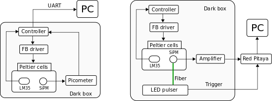
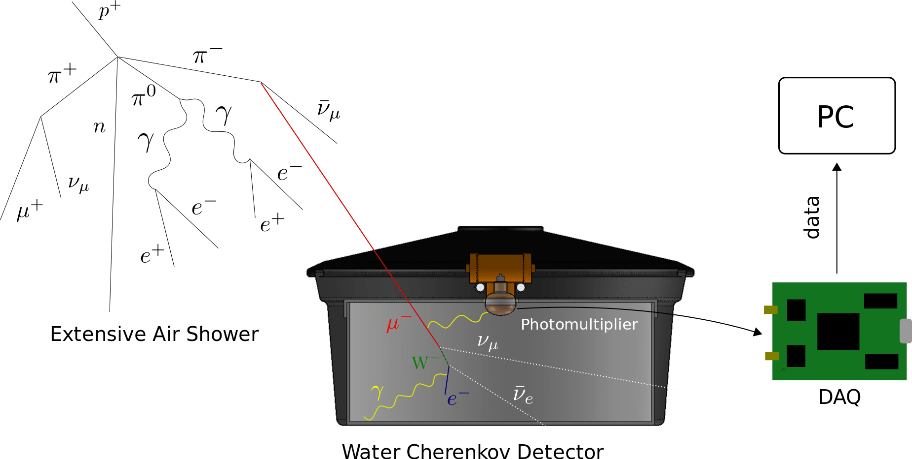
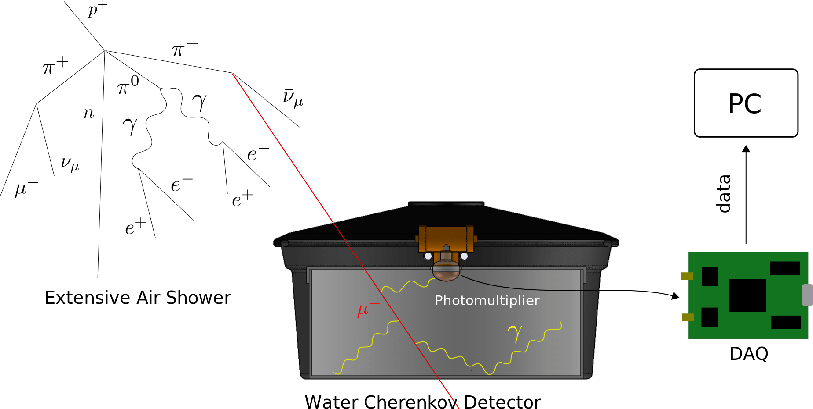
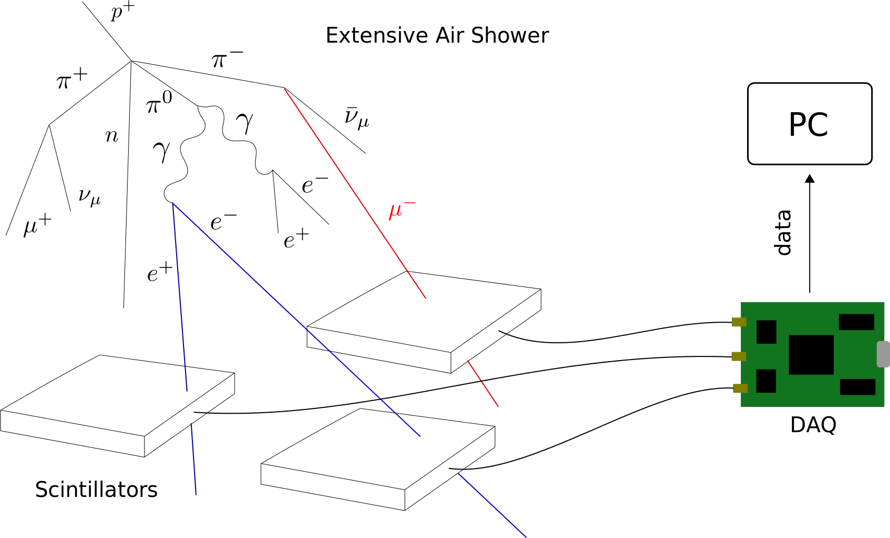
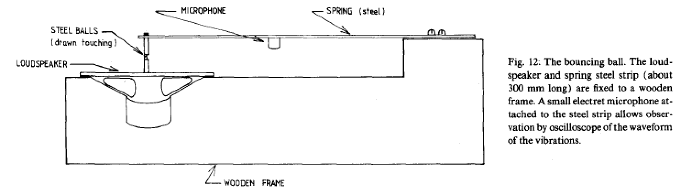
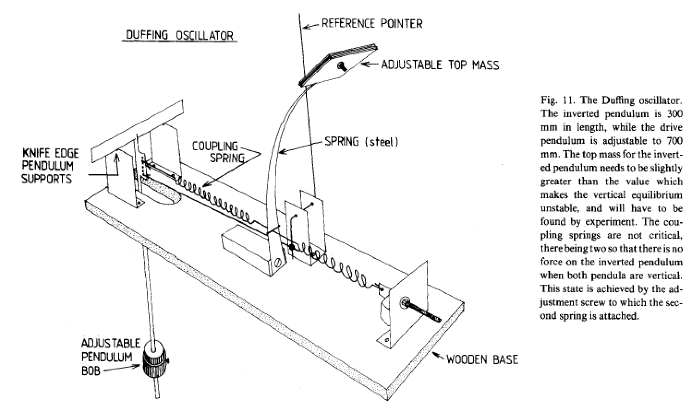

# Proyectos Módulo de Instrumentación

## Responsables del curso
* [Reina Camacho Toro, (CNRS, Francia)](https://laconga.redclara.net/reina-camacho-toro/)
* [Luis Nuñez, (UIS, Colombia)](https://laconga.redclara.net/luis-a-nunez/)
* [Mario Cosenza, (Yachay, Ecuador)](https://laconga.redclara.net/mario-cosenza/)

A continuación se listan los proyectos finales de las filiales: Altas Energías y Sistemas Complejos. En cada uno de ellos se adjuntan recursos bilbiográficos del fenómeno físico a estudiar y una breve descripción del montaje experimental.

### Altas Energías

#### Cronograma de acceso remoto 

Los estudiantes tendrán 24 horas empezando a  las 10 a.m. del día asignado para adquirir los datos de cada proyecto.

| Viernes 9  |  Sábado 10 | Domingo 11  | Lunes 12  | Martes 13 | Miércoles 14 |
|---|---|---|---| ---| ---|
| **EAS**| ooo | ooo  | Calibración WCD  | **Vida Media del Muón** | **Calibración WCD** |
| **SiPM Hamamatsu**  | ooo  | ooo  | ooo  |ooo | ooo |

* Se pueden adicionar nuevos horarios de acceso si se presenta alguna dificultad. Comunicarlo al Mattermost.

* Se aconseja realizar el reporte del proyecto (objetivos, procedimiento, discusión, conclusiones) en notebooks Jupyter

#### **Caracterización del SiPM CPTA-151**

En este proyecto los estudiantes realizan la caracterización completa del fotomultiplicador de Silicio CPTA-151. Estos parámetros son: voltaje de ruptura, ganancia, espectro de fotoelectrón y ruido (conteo oscuro, _crosstalk_ y _afterpulsing_). Los parámetros de control es el voltaje de polarización y la temperatura del SiPM.

Recursos:

* P. Eckert et al. _Characterisation studies of silicon photomultipliers_. Nuclear Instruments and Methods in
Physics Research A. 2010. [http://doi.org/10.1016/j.nima.2010.03.169](http://doi.org/10.1016/j.nima.2010.03.169)

* [An Introduction to the Silicon Photomultiplier](https://gitmilab.redclara.net/tutoriales/tutorial-mkdocs/-/blob/master/docs/modulo-instrumentacion/proyectos/Recursos/An_Introduction_to_the_Silicon_Photomultiplier)

Instrumento:

* J. Sánchez-Villafrades et al. _Characterization and on-field performance of the MuTe Silicon Photomultipliers_. arXiv. 2021. [https://arxiv.org/abs/2102.01119](https://arxiv.org/abs/2102.01119)

Guía:

En el siguiente link encuentran la guía del proyecto en forma de Jupyter Notebook. Esta describe los pasos para acceder remotamente al instrumento así como su configuración y toma de datos.

[Guía del proyecto](https://gitmilab.redclara.net/tutoriales/tutorial-mkdocs/-/blob/master/docs/modulo-instrumentacion/proyectos/Guias/SiPM)

Video:

[Equipo de caracterizacióón de SiPM/APD](https://youtu.be/lUCia0oZO-8)

Montaje:

Persona de contacto:

* [Jesús Rodríguez, (UIS, Colombia)](https://laconga.redclara.net/jesus-pena-rodriguez/)

#### **Caracterizacón de un SiPM Hamamatsu S13360**

En este proyecto los estudiantes realizan la caracterización completa del fotomultiplicador de Silicio Hamamtsu S13360. Estos parámetros son: voltaje de ruptura, ganancia, espectro de fotoelectrón y ruido (conteo oscuro, _crosstalk_ y _afterpulsing_). Los parámetros de control es el voltaje de polarización y la temperatura del SiPM.

Recursos:

* P. Eckert et al. _Characterisation studies of silicon photomultipliers_. Nuclear Instruments and Methods in
Physics Research A. 2010. [http://doi.org/10.1016/j.nima.2010.03.169](http://doi.org/10.1016/j.nima.2010.03.169)

* [An Introduction to the Silicon Photomultiplier](https://gitmilab.redclara.net/tutoriales/tutorial-mkdocs/-/blob/master/docs/modulo-instrumentacion/proyectos/Recursos/An_Introduction_to_the_Silicon_Photomultiplier)

Instrumento:

* J. Sánchez-Villafrades et al. _Characterization and on-field performance of the MuTe Silicon Photomultipliers_. arXiv. 2021. [https://arxiv.org/abs/2102.01119](https://arxiv.org/abs/2102.01119)

Guía:

En el siguiente link encuentran la guía del proyecto en forma de Jupyter Notebook. Esta describe los pasos para acceder remotamente al instrumento así como su configuración y toma de datos.

[Guía del proyecto Ganancia/Ruido](https://gitmilab.redclara.net/tutoriales/tutorial-mkdocs/-/blob/master/docs/modulo-instrumentacion/proyectos/Guias/SiPM)

[Guía del proyecto Curvas IV](https://gitmilab.redclara.net/tutoriales/tutorial-mkdocs/-/blob/master/docs/modulo-instrumentacion/proyectos/Guias/SiPM_IV/SiPM-IV_Characterization.ipynb)

Video:

[Equipo de caracterizacióón de SiPM/APD](https://youtu.be/lUCia0oZO-8)

Profundización:

* P. Simon. _Silicon photomultipliers in particle and nuclear physics_. Nuclear Instruments and Methods in
Physics Research A. 2019. [https://doi.org/10.1016/j.nima.2018.11.042](https://doi.org/10.1016/j.nima.2018.11.042)

Montaje:

Persona de contacto:

* [Jesús Rodríguez, (UIS, Colombia)](https://laconga.redclara.net/jesus-pena-rodriguez/)

#### **Estimación de la vida media del muón**

Este proyecto consiste en estimar la vida media del muón usando los datos colectados por un contador Cherenkov (WCD). El WCD mide la radiación Cherenkov emitida por los muones atmosféricos que lo atarviesan y de los electronces producto del decaimiento del muón.

Recursos:

* F. Riggi et al. _Muon decay: an old, yet alive experiment in the university physics curriculum_. European Journal of Physics. 2016. [http://doi.org/10.1088/0143-0807/37/4/045702](http://doi.org/10.1088/0143-0807/37/4/045702)

* M. Alarcón et al. _Calibration and monitoring of water Cherenkov detectors with stopping and crossing muons_. Nuclear Instruments and Methods in Physics Research Section A: Accelerators, Spectrometers, Detectors and Associated Equipment. 1999. [https://www.sciencedirect.com/science/article/abs/pii/S0168900298009206](https://www.sciencedirect.com/science/article/abs/pii/S0168900298009206)

Instrumento:

* S. Haro and H. Arnaldi. _The data acquisition system of the Latin American Giant Observatory (LAGO)_. Nuclear Instruments and Methods in Physics Research Section A: Accelerators, Spectrometers, Detectors and Associated Equipment. 2016 [https://doi.org/10.1016/j.nima.2016.02.101](https://doi.org/10.1016/j.nima.2016.02.101)

* [The LAGO electronics guide](https://gitmilab.redclara.net/tutoriales/tutorial-mkdocs/-/blob/master/docs/modulo-instrumentacion/proyectos/Recursos/LAGO_Official_Electronics_guide.pdf)

Guía:

En el siguiente link encuentran la guía del proyecto en forma de Jupyter Notebook. Esta describe los pasos para acceder remotamente al instrumento así como su configuración y toma de datos.

[Guía del proyecto](https://gitmilab.redclara.net/tutoriales/tutorial-mkdocs/-/tree/master/docs/modulo-instrumentacion/proyectos/Guias/Muon_Decay)

Video:

[El detector Cherenkov de agua](https://youtu.be/rZ7Y1dnk-dE)

Profundización:

* F. Renga. _Experimental searches for muon decays beyond the Standard
Model_. Reviews in Physics. 2019. [https://doi.org/10.1016/j.revip.2019.100029](https://doi.org/10.1016/j.revip.2019.100029)

Montaje:

Persona de contacto:

* [Jesús Rodríguez, (UIS, Colombia)](https://laconga.redclara.net/jesus-pena-rodriguez/)

#### **Calibración de un detector Cherenkov de agua**

Los detectores Cherenkov (WCD) juegan un rol importante en la física de altas energías y astropartículas. Algunos experimentos que usan esta tecnología son: IceTop/IceCube, Super Kamiokande, Pierre Auger y HAWC (High-Altitude Water Cherenkov Observatory). En este proyecto los estudiantes llevarán a cabo la calibración del fotomultiplicador del WCD y su calibración de energía.

Recursos:

* B. Ratcliff and J. Schwiening. _Cherenkov Counters_ . 2012. [https://doi.org/10.1007/978-3-642-13271-1_18](https://doi.org/10.1007/978-3-642-13271-1_18)

Instrumento:

* S. Haro and H. Arnaldi. _The data acquisition system of the Latin American Giant Observatory (LAGO)_. Nuclear Instruments and Methods in Physics Research Section A: Accelerators, Spectrometers, Detectors and Associated Equipment. 2016 [https://doi.org/10.1016/j.nima.2016.02.101](https://doi.org/10.1016/j.nima.2016.02.101)

* [The LAGO electronics guide](https://gitmilab.redclara.net/tutoriales/tutorial-mkdocs/-/blob/master/docs/modulo-instrumentacion/proyectos/Recursos/LAGO_Official_Electronics_guide.pdf)

Guía:

En el siguiente link encuentran la guía del proyecto en forma de Jupyter Notebook. Esta describe los pasos para acceder remotamente al instrumento así como su configuración y toma de datos.

[Guía del proyecto](https://gitmilab.redclara.net/tutoriales/tutorial-mkdocs/-/tree/master/docs/modulo-instrumentacion/proyectos/Guias/WCD_Calibration)

Video:

[El detector Cherenkov de agua](https://youtu.be/rZ7Y1dnk-dE)

Profundización:

* Pierre Auger Callaboration. _Studies on the response of a water-Cherenkov detector of the Pierre Auger Observatory to atmospheric muons using an RPC hodoscope_. Journal of Instrumentation. 2020. [https://doi.org/10.1088/1748-0221/15/09/P09002](https://doi.org/10.1088/1748-0221/15/09/P09002)

Montaje:

Persona de contacto:

* [Jesús Rodríguez, (UIS, Colombia)](https://laconga.redclara.net/jesus-pena-rodriguez/)

#### **Detección de lluvias aéreas extensas**

La detección y parametrización de lluvias aéreas extensas permite caracterizar el espectro de rayos cósmicos que impactan la Tierra. La detección indirecta de radiación cósmica de alta energía se hace mediante grandes observatorios como Pierre Auger, HAWC (High-Altitude Water Cherenkov Observatory) y LHAASO (Large High Altitude Air Shower Observatory).

Recursos:

* P. Sommers. _Extensive air showers and measurement techniques_. 2004. [https://doi.org/10.1016/j.crhy.2004.03.009](https://doi.org/10.1016/j.crhy.2004.03.009)

Instrumento:

* [The Escaramujo electronics guide](https://gitmilab.redclara.net/tutoriales/tutorial-mkdocs/-/blob/master/docs/modulo-instrumentacion/proyectos/Recursos/EscaramujoUserManual.pdf)

Video:

[El detector Escaramujo](https://youtu.be/1wKvOfXQRbg) 

Profundización:

* R. Batista et al. _Open Questions in Cosmic-Ray Research at Ultrahigh Energies_. Front. Astron. Space Sci. 2019. [https://doi.org/10.3389/fspas.2019.00023](https://doi.org/10.3389/fspas.2019.00023)

Guía:

En el siguiente link encuentran la guía del proyecto en forma de Jupyter Notebook. Esta describe los pasos para acceder remotamente al instrumento así como su configuración y toma de datos.

[Guía del proyecto](https://gitmilab.redclara.net/tutoriales/tutorial-mkdocs/-/blob/master/docs/modulo-instrumentacion/proyectos/Guias/EAS)

Montaje:

Persona de contacto:

* [Jesús Rodríguez, (UIS, Colombia)](https://laconga.redclara.net/jesus-pena-rodriguez/)

### Sistemas Complejos and más

#### **La brújula caótica**

* Una brújula en un campo magnético giratorio...
* Un sistema sencillo que permite acercarse a las nociones de caos como duplicación de periodos, ... ¡a estudiar!

Recursos:

* [Critical Scaling Behavior in Coupled Magnetic Oscillators](https://www.researchgate.net/publication/253515543_Critical_scaling_behavior_in_coupled_magnetic_oscillators). SY Kim, Int. J. Mod. Phys. B, 13, 2405 (1999)

* Simple experiments in chaotic dynamics. K. Briggs, Am. J. Phys. 55, 1083 (1987)

Persona de contacto:

* [Werner Bramer Escamilla, (Yachay, Ecuador)](https://laconga.redclara.net/werner-bramer-escamilla/)
* [Mario Cosenza, (Yachay, Ecuador)](https://laconga.redclara.net/mario-cosenza/)

#### **Más sobre el péndulo doble**

* Estudia a profundidad el comportamiento caótico de este sistema compuesto por dos péndulos, con el segundo colgando del extremo del primero!

Recursos:

* [T. Shinbrot, C. Grebogi, J. Wisdom, and J.A. Yorke, Am J Phys 60, 491 (1992)](https://hal.archives-ouvertes.fr/hal-01403609)

* Peter.H. Richter and Hans-Joachim Scholz, "Chaos in Classical Mechanics: The Double Pendulum," pp 86-97, Fachbereich Physik der Universität Bremen, D-2800 Bremen 33, Fed. Rep. of Germany.

Persona de contacto:

* [Werner Bramer Escamilla, (Yachay, Ecuador)](https://laconga.redclara.net/werner-bramer-escamilla/)
* [Mario Cosenza, (Yachay, Ecuador)](https://laconga.redclara.net/mario-cosenza/)

#### **La pelota que rebota**

* Una pelota parcialmente elástica que rebota en una superficie sinusoidal que vibra verticalmente hacia el caos

Recursos:

* Simple experiments in chaotic dynamics. K. Briggs, Am. J. Phys. 55, 1083 (1987)

Persona de contacto:

* [Werner Bramer Escamilla, (Yachay, Ecuador)](https://laconga.redclara.net/werner-bramer-escamilla/)
* [Mario Cosenza, (Yachay, Ecuador)](https://laconga.redclara.net/mario-cosenza/)

#### **El oscilador de Duffing**

Recursos:

* Simple experiments in chaotic dynamics. K. Briggs, Am. J. Phys. 55, 1083 (1987)

Persona de contacto:

* [Werner Bramer Escamilla, (Yachay, Ecuador)](https://laconga.redclara.net/werner-bramer-escamilla/)
* [Mario Cosenza, (Yachay, Ecuador)](https://laconga.redclara.net/mario-cosenza/)

#### **Experimentando la gravedad con una manta de caucho**

* Una experimento do-it-yourself (DIY) que te permitirá entender mejor los conceptos de relatividad general a través de analogías
* ¿Son las órbitas de los objetos en un medio elástico realmente comparables a las órbitas gravitatorias?

Recursos:

* Experience gravity in the classroom using the rubber sheet: an educational proposal from the collaboration between University and School. Adriana Postiglione e Ilaria De Angel. 2021 Phys. Educ. 56 025019. [arXiv:2101.04652](https://arxiv.org/abs/2101.04652)

Persona de contacto:

* [José Ocariz, (UP, Francia)](https://laconga.redclara.net/jose-ocariz/)

### Opción libre

* ¿Tienes algún experimento en mente bien sea en el área de FAE o SC? Lo podemos discutir!

## Dinámica de trabajo

* En pareja (de diferentes universidades y ciudades, mejor aún si son de diferentes países)
* Una vez que hayas decidido que proyecto quieres comunicanos el nombre de los integrantes de tu equipo y el proyecto escogido en el mattermost, canal "MI-3 Proyectos hands-on". Mattermost será nuestro canal de comunicación preferido.
* Contacta a la persona de contacto de tu proyecto para empezar (mantén en el loop a los responsables del curso!)

## Calendario

* Semana 1 (Marzo 22-26, 2021): Eleccion de proyecto y revisión bibliográfica
* Semana 2: Semana Santa
* Semanas 3-5: Diseño del experimento + toma y análisis de datos
* Semanas 6-7: Lectura de profundizacion + preparacion de la presentación y del reporte
* Semana 8 (Mayo 10-14, 2021): Presentación + entrega del reporte

